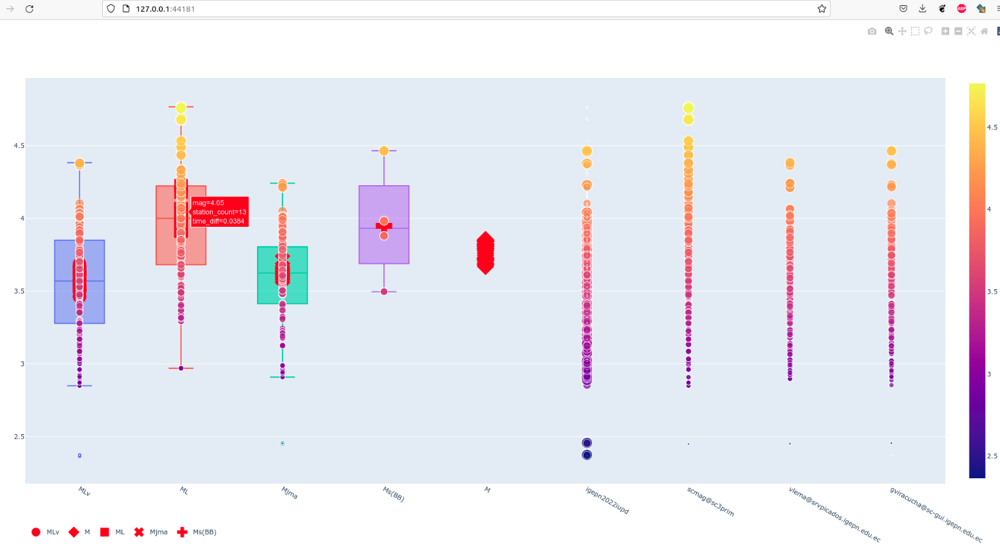

Code to create statistic information from events stored in the seiscomp3 database, FDSN or data generated by SCEVTLOG

# Installation
## Create the conda environment

``` bash
$ conda create -n sc3_statistics python=3.10

$ conda activate sc3_statistics
$ conda  config --add channels conda-forge

$ conda install obspy influxdb pygelf pandas bs4

$ pip install get_mseed_data

```

# Run event stats

## Config file options

``` bash

[RUN_MODE]
mode= SINGLE | ONEDAY | SOMEDAYS
data_target = STDOUT | DB 

```

## Execute 
```
$ python ./run_event_stats.py ./config_event_stats_single.txt igepn2021zqko

```

# Run event magnitude stats

## Config file options

``` bash

[RUN_MODE]
mode= FDSN | LOCAL | SINGLE | LIST 
data_target = STDOUT | DB 

```
## Execute 
```
python ./run_event_variation.py ./config_variation.txt ./PATH_TO_EVENT/
```




